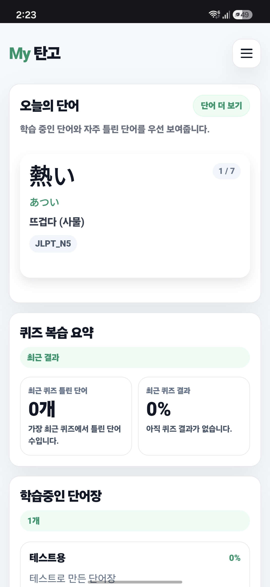
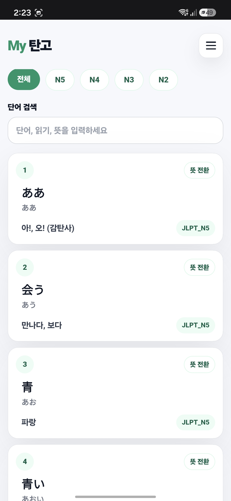
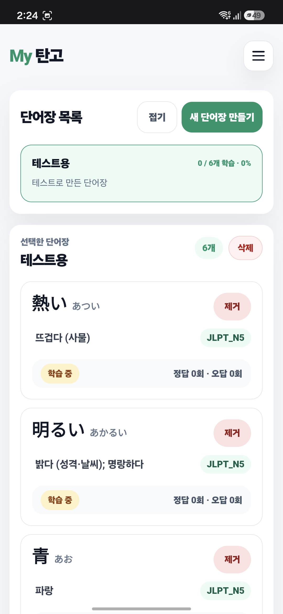

# 나만의 JLPT 단어장 My탄고

## My탄고란?
[My탄고](https://jp-vocabularybook.vercel.app/)는 일본어를 처음 공부하다보면은 히라가나와 가타카나를 배운뒤 간단한 단어와 문법을 배우기 시작하는데<br/>
정작 JLPT 시험에 쓰이는 단어들은 뭐가 있는지, 단어장을 사야할지, 일본어 책을 사야할지 잘 모르게되는데  
그러한 고민을 해결하기위해 JLPT의 단어들을 자신만의 단어장을 만들어 사용할 수 있는 웹 서비스이다.

## 주요 기능
1. 회원가입 및 로그인
2. 단어장 기능  
     -단어장 삭제 및 생성  
     -단어 추가 및 삭제  
     -단어 상태(학습중, 학습함) 관리  
3. 단어장 퀴즈(아직 미완)  
     -여러 단어장중 하나를 골라 퀴즈풀이  
     -퀴즈 결과 보기  
4. 오늘의 단어 추천
5. 히라가나/가타카나 보기
6. 반응형 디자인으로 모바일 뷰 가능

## 기술 스택
- Next.js : 단어장의 특징인 많은 데이터들을 미리 로드하기 위해 SSR을 선택
- Zustand : 전역 상태를 간결하게 관리하고, 컴포넌트 간 상태 공유를 효율적으로 처리하기 위해 선택
- TypeScript : 타입 안정성을 확보하고, 정적 타입 기반 개발 경험을 쌓기 위해 사용
- Supabase : 인증, 데이터베이스, RLS 정책 관리
- Vercel : GitHub 연동 기반 CI/CD 배포

## 미리 보기
<p>
  <p>왼쪽에서부터 메인페이지, 단어목록 페이지, 단어장 페이지이며 모바일 기준으로 디자인한 반응형이다.</p>
  <div>
    
    
    
  </div>
</p>

## 로컬 실행 방법
이 프로젝트는 Supabase를 사용하므로 로컬에서 실행하려면 별도의 Supabase 프로젝트와 환경 변수 설정이 필요합니다.
### 1. 클론 및 패키지 설치
```bash
git clone https://github.com/howarf/jp_vocabularybook.git
cd project-name
npm install
```
### 2. 환경 변수 설정
프로젝트 루트에 .env.local파일을 생성해 작성
``` env
NEXT_PUBLIC_SUPABASE_URL = your_supabase_project_url
NEXT_PUBLIC_SUPABASE_ANON_KEY = your_supabase_anon_key
```
### 3. 개발 서버 실행
```bash
npm dev run
```

## 프로젝트 구조
```text
├── app/              # Next.js App Router 기반 페이지
├── components/       # 재사용 가능한 UI 컴포넌트
├── lib/              # Supabase 클라이언트 및 공통 설정
├── stores/           # Zustand 전역 상태 관리
├── types/            # TypeScript 타입 정의
└── utils/            # 공통 유틸 함수
```

## 개발 과정에서의 고민
### Supabase선택과 DB 구조및 RLS설계에 대해
제일 처음 프로젝트를 기획했을 때 로컬 db를 사용해서 작업 후 git에 같이 업로드할 생각이였으나 Vercel로 CI/CD를 선택함으로써 DB도 호스팅 방식을 사용해서 해보자란 생각과 유저계정 관리와 request들을 확인할 수 있다는 점에 내가 만든 서비스가 어떻게 작동하고 있는지 볼 수 있다는 장점을 보고 선택하게 되었습니다. 그리고 그에따른 DB의 구조를 간결화 할 수 있었으며 Supabase RLS 정책을 사용해 로그인한 사용자가 본인의 단어장과 단어 데이터에만 접근할 수 있도록 설계했습니다.

### 오늘의 단어 작동 방식에 대한 선택
기존에는 슬라이드로 오늘의 단어를 보여주는 방식이였으나 카드의 wdith와 이동, overflow, 마지막 인덱스일때의 보정등이 복잡하게 얽혀버려 더 직관적이고 안전하고 단순한 방식인 스택형식으로 변경하여 문제를 해결함과 동시에 UX를 향상시켰습니다. 

### UI/UX에 대한 고민
pc와 모바일의 UI에 대해 좀 더 좋은 UX를 제공하기위해 직접 기능들을 테스트 해보며 수정했습니다.

## 향후 추가할 기능들
1. N1단어 추가하기
2. 히라가나/가타카나의 탁음,반탁음,촉음,요음등 추가하기
3. 퀴즈 추가 및 다듬기
